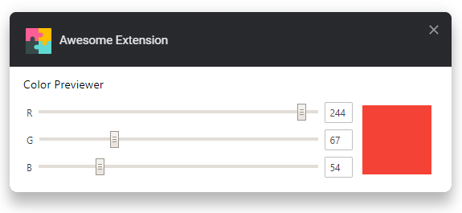

# browser-extension-template

[link-webext-polyfill]: https://github.com/mozilla/webextension-polyfill
[link-rgh]: https://github.com/sindresorhus/refined-github
[link-ngh]: https://github.com/sindresorhus/notifier-for-github
[link-hfog]: https://github.com/sindresorhus/hide-files-on-github
[link-tsconfig]: https://github.com/sindresorhus/tsconfig
[link-options-sync]: https://github.com/fregante/webext-options-sync
[link-cws-keys]: https://github.com/DrewML/chrome-webstore-upload/blob/master/How%20to%20generate%20Google%20API%20keys.md
[link-amo-keys]: https://addons.mozilla.org/en-US/developers/addon/api/key

> Cross-browser extension boilerplate - barebones template with Parcel 2, options handler and auto-publishing.

Screenshot of extension options:

## Features

- Uses Manifest v3 ([not yet compatible with Firefox](https://bugzilla.mozilla.org/show_bug.cgi?id=1578284))
- Use npm dependencies thanks to Parcel 2.
- Use modern promise-based `browser.*` APIs [webextension-polyfill][link-webext-polyfill].
- [Auto-syncing options](#auto-syncing-options).
- [Auto-publishing](#publishing) with auto-versioning and support for manual releases.
- [Extensive configuration documentation](#configuration).

## Getting started

### 1️⃣ Create your own copy

1. Click [<kbd>Use this template</kbd>](https://github.com/fregante/browser-extension-template/generate) to make a copy of your own. 😉

### 🛠 Build locally

1. Checkout the copied repository to your local machine eg. with `git clone https://github.com/my-username/my-awesome-extension/`
1. Run `npm install` to install all required dependencies
1. Run `npm run build`

The build step will create the `distribution` folder, this folder will contain the generated extension.

### 🏃 Run the extension

Using [web-ext](https://extensionworkshop.com/documentation/develop/getting-started-with-web-ext/) is recommened for automatic reloading and running in a dedicated browser instance. Alternatively you can load the extension manually (see below).

1. Run `npm run watch` to watch for file changes and build continuously
1. Run `npm install --global web-ext` (only only for the first time)
1. In another terminal, run `web-ext run -t chromium --arg="--window-size=1920,1080" --arg="--auto-open-devtools-for-tabs"`
1. Check that the extension is loaded by opening the extension options ([in Firefox](media/extension_options_firefox.png) or [in Chrome](media/extension_options_chrome.png)).

#### Manually

You can also [load the extension manually in Chrome](https://www.smashingmagazine.com/2017/04/browser-extension-edge-chrome-firefox-opera-brave-vivaldi/#google-chrome-opera-vivaldi) or [Firefox](https://www.smashingmagazine.com/2017/04/browser-extension-edge-chrome-firefox-opera-brave-vivaldi/#mozilla-firefox).

## TODO
- [ ] Word colors config
- [ ] TTS voices config (which voice, rate)
- [ ] Profile laggy pages
- [ ] Add more padding around individual words
- [ ] Word tracker mode on/off (maybe by a hotkey)
- [ ] Hover translate mode on/off (maybe by a hotkey)
- [ ] Convert CEDICT dictionary to JSON (for faster load time?) instead of parsing this txt file line by line. Research background page capabilites for this, maybe it can be cached there instead of loading it on every refresh of the page
- [ ] Style popup more professionally
